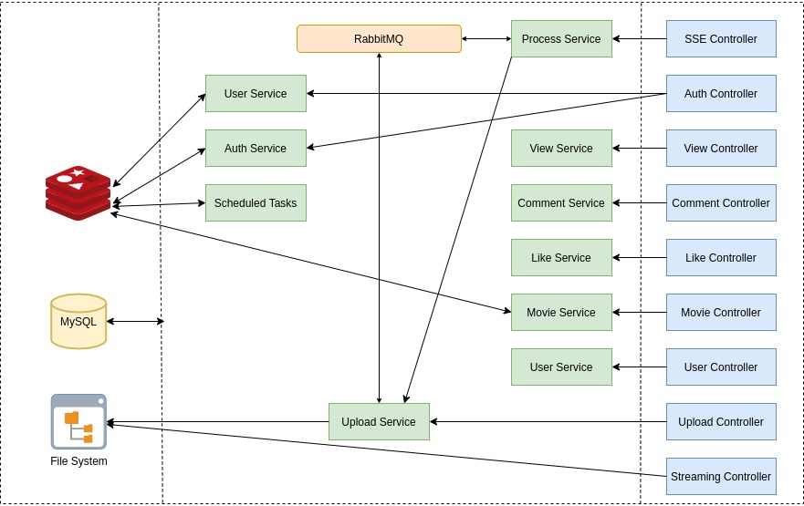

## Backend for Movi3

Movi3 is learning based full stack web application for streaming, storing and transcoding movies. Built using [Spring Boot](https://github.com/YasserYka/Movi3), [React](https://github.com/YasserYka/Movi3-React) and flutter.

### Features
| Features |
|-|
| Reset password token will be sent to the client email as url, token is stored in redis and removed after TTL expiration. |
| Login and prevent brute force attack and lock account after 5 concurrent failed login attempts, and use Retry-After http-header for the frontend |
| After signing up verification email will be sent to clients email |
| Support advanced search for 3 optional attributes (title, rating and release date) |
| Support partial content, which sends part of the video based on http-header "Range" |
| Support quick search by movie title support insensitive case |
| Store list for movies to be watched later for each user |
| Server sent event is used to send percentage of current movie being processed in to visualize the progression of the process in frontend. |
| Support adaptive bitrate streaming, which detect user's bandwidth and CPU capacity and adjust quality of video being streamed in real-time (Basically similar to YouTube's videos in Auto-Mode). |
| Stores unique views of users, it stores all kind of movie views in Redis and runs a scheduled task to remove duplicate user views for the same movie persist the result in the database. |
| Stores 10 most recently watched movies in Redis which uses LRU algorithm |
| For each video uploaded will create for it four message to be inserted in RabbitMQ based on current video resolution, it will create a message a audio extraction, convert to 360p resolution, convert to 480p resolution, convert to 720p resolution and create manifest file for processing. |
| Support JWT authentication |
| Support Swagger UI |
| Calculate trending score for each movie every two hours based on views and likes ratio |

### System Components

